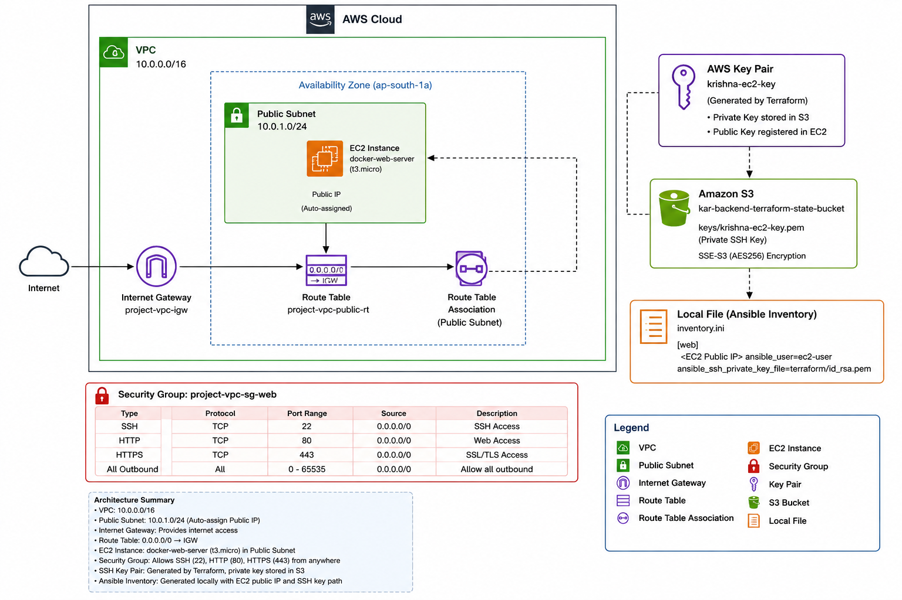
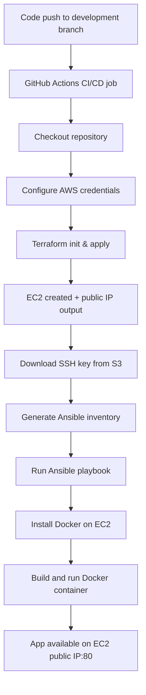
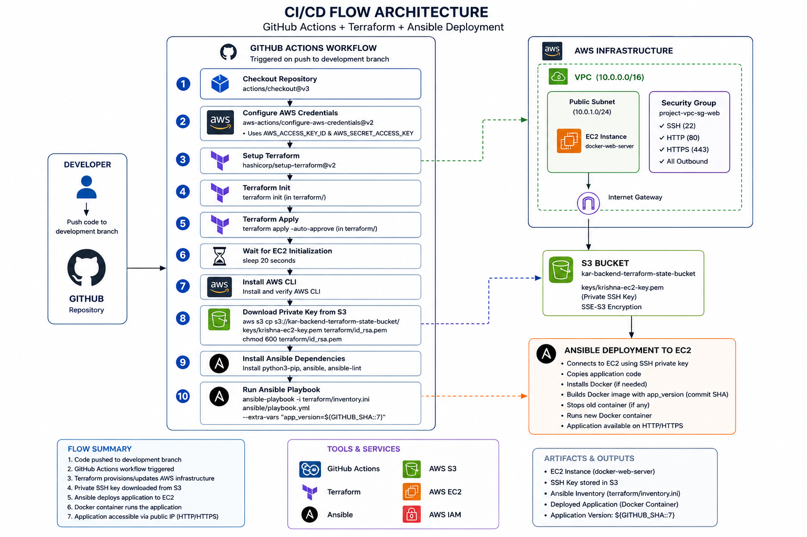
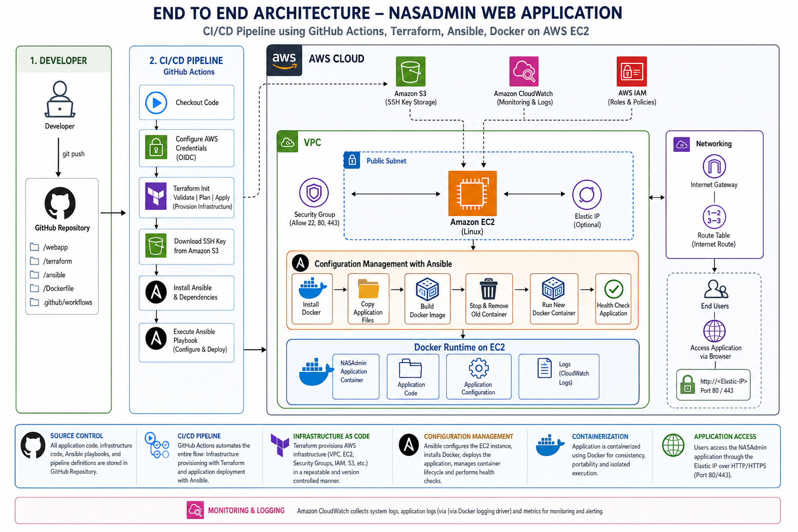

# NETWORKS AND SYSTEMS ADMINISTRATION Project Repository

### 👥 Team Contributions

* **Krishna Rao Seelam**: Contributed to overall project planning, execution, and documentation.
* **Karthik Gunnam**: Contributed to the development of Terraform code and its related documentation.
* **Yogeshreddy Abbireddy**: Contributed to the development of Ansible, application code, and related documentation.
* **Vidya Sagar**: Contributed to the development of the CI/CD pipeline and its related documentation.

## Overview

This repository demonstrates an end-to-end AWS infrastructure and deployment pipeline using:
- Terraform for AWS resources provisioning
- Ansible for EC2 configuration and Docker deployment
- Ansible for Docker containerizing the web application
- GitHub Actions for CI/CD orchestration

The pipeline provisions an EC2 instance, retrieves the SSH key from an S3 bucket, connects to the instance over SSH, installs Docker, builds the app image, and deploys the web application container.

## Project Structure

```
nasadmin-project-repo-development/
│
├── .github/
│   └── workflows/
│       └── cicd-pipeline.yml          # GitHub Actions CI/CD pipeline
│
├── ansible/
│   ├── inventory.ini                  # Dynamic inventory (updated after Terraform)
│   ├── playbook.yml                   # Main Ansible playbook
│   │
│   └── roles/
│       └── docker/
│           ├── files/
│           │   └── webapp/
│           │       ├── Dockerfile
│           │       ├── app.py
│           │       ├── requirements.txt
│           │       │
│           │       └── templates/
│           │           └── index.html
│           │
│           └── tasks/
│               └── temp-main.yml      # Docker installation & deployment tasks
│
├── terraform/
│   ├── provider.tf                    # AWS provider configuration
│   ├── variables.tf                   # Input variables
│   ├── main.tf                        # EC2, Security Group, networking resources
│   ├── outputs.tf                     # Terraform outputs
│   └── s3-backend-setup.tf            # Terraform remote backend configuration
│
├── README.md
└── .gitignore
```

## Architecture Diagram

### AWS Infrastructure Architecture

The following diagram shows AWS architecture with resources used to setup the infrastructure using terrafrom.  



### CI/CD Pipeline Flow

Github workflow is used to setup required CICD pipeline. The pipeline flow below describes the exact steps executed by the GitHub Actions workflow.




## Example Values

Use these sample values when configuring or validating the pipeline.

- AWS region: `eu-west-1`
- Terraform state bucket: `kar-backend-terraform-state-bucket`
- SSH private key S3 object: `keys/krishna-ec2-key.pem`
- Local downloaded key path: `terraform/id_rsa`
- Ansible host user: `ec2-user`
- EC2 security group ports: `22` for SSH and `80` for HTTP
- Web application access URL: `http://<EC2_PUBLIC_IP>/`

### Example Terraform Output

```bash
terraform -chdir=terraform output -raw ec2_public_ip
# 18.203.45.171
```

### Example Ansible Inventory Entry

```ini
[web]
18.203.45.171 ansible_user=ec2-user ansible_ssh_private_key_file=terraform/id_rsa
```
## What the Pipeline Does

1. **Terraform** provisions AWS resources:
   - VPC and public subnet
   - Security group allowing SSH and HTTP
   - EC2 instance with a generated key pair
   - S3 object that stores the private SSH key
   - Outputs the EC2 public IP

2. **GitHub Actions** runs after pushes to the `development` branch:
   - sets AWS credentials
   - runs `terraform apply`
   - downloads the SSH private key from S3
   - installs Ansible dependencies
   - runs the Ansible playbook against the EC2 host

3. **Ansible** configures the EC2 host:
   - installs Docker
   - copies the `webapp/` code to the EC2 instance
   - builds a Docker image from `Dockerfile`
   - starts a container exposing port `80`

4. **Docker** runs the web application in a container, making it available through the EC2 public IP.

## Detailed Component Explanation

### Terraform

Relevant files:
- `terraform/main.tf`
- `terraform/outputs.tf`
- `terraform/provider.tf`
- `terraform/variables.tf`

Key behavior:
- Creates an AWS VPC and subnet
- Declares a security group for SSH and web traffic
- Generates an RSA key pair (`tls_private_key` and `aws_key_pair`)
- Uploads the private key PEM to S3
- Creates EC2 instances using the generated key
- Exposes `ec2_public_ip` output to connect with Ansible

### Ansible

Relevant files:
- `ansible/playbook.yml`
- `ansible/inventory.ini`
- `ansible/roles/docker/tasks/main.yml`

Key tasks:
- install dependencies for Docker
- install and start the Docker service
- copy the web application files to `/home/ubuntu/webapp/`
- build a Docker image named `webapp`
- run a container bound to host port `80`

### Docker Application

Relevant files:
- `webapp/Dockerfile`
- `webapp/app.py`

The application is built into a Docker image and executed as a container on the EC2 instance. The container listens on port `80` so incoming HTTP traffic to the EC2 public IP is served by the app.

## Execution and Deployment

### Prerequisites

- AWS account with credentials in GitHub Secrets:
  - `AWS_ACCESS_KEY_ID`
  - `AWS_SECRET_ACCESS_KEY`
- Terraform installed
- Ansible installed (GitHub Actions installs via pip)
- AWS CLI installed in the runner
- Proper IAM permissions for Terraform and S3 access

### Manual Local Execution

1. Initialize and apply Terraform:

```bash
cd terraform
terraform init
terraform apply -auto-approve
```

2. Download the SSH private key from the S3 bucket:

```bash
aws s3 cp s3://kar-backend-terraform-state-bucket/keys/krishna-ec2-key.pem terraform/id_rsa
chmod 600 terraform/id_rsa
```

3. Create an Ansible inventory file:

```bash
IP=$(terraform -chdir=terraform output -raw ec2_public_ip)
cat > ansible/inventory.ini <<EOF
[web]
$IP ansible_user=ubuntu ansible_ssh_private_key_file=terraform/id_rsa
EOF
```

4. Run the Ansible playbook:

```bash
ansible-playbook -i ansible/inventory.ini ansible/playbook.yml
```

### GitHub Actions Execution

The CI/CD pipeline is defined in `.github/workflows/cicd-pipeline.yml` and runs on pushes to `development`.

The workflow:
- checks out the repository
- configures AWS credentials
- runs `terraform init` and `terraform apply`
- waits for EC2 initialization
- downloads the EC2 SSH key from S3
- installs Ansible
- runs the Ansible playbook against the EC2 host

## Notes and Best Practices

- The pipeline expects the SSH key object to exist in the configured S3 bucket after Terraform execution.
- The EC2 instance uses `ec2-user` as the SSH user; if the AMI differs, update the Ansible inventory user.
- The security group allows SSH and HTTP traffic; verify this before deployment.
- If the container fails to start, log in to EC2 and inspect the Docker container status.
- Secrets can be managed in a better way using the secrets IAM services in aws.
- Can modularise the terraform code for better reusablity if more number of services needed for project.
- Can create custom Images for EC2 and runner node to reduce build time and stable/approved software versions.

## Troubleshooting

- If Ansible cannot connect:
  - verify `terraform/id_rsa` exists and has correct permissions
  - verify the public IP matches the EC2 instance
  - verify S3 permissions allow `GetObject`

- If Docker fails on EC2:
  - verify Docker service is running
  - verify `webapp/` files were copied correctly
  - inspect logs with `docker ps` and `docker logs <container>`

## What to Expect After Deployment



- A public EC2 instance running the web app in Docker
- The app accessible from the public IP over HTTP on port `80`
- A GitHub Actions workflow execution correlating with your code push
- Reproducible infrastructure changes through Terraform
- Repeatable configuration and deployment through Ansible

---

For changes, update the Terraform or Ansible configuration, then commit to the `development` branch to trigger the CI/CD pipeline.
